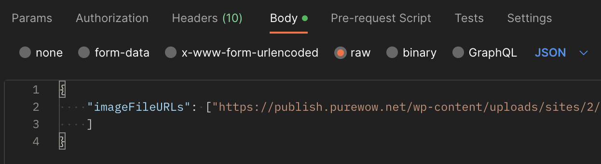

# Making an API Call

The Vana API is hosted at `https://api.vana.com/api/v0/`

#### Headers 

All API Endpoints require the header: `Content-Type: application/json`

Authorized API calls require the header: `Authorization: Bearer $TOKEN`\
The `$TOKEN` is a JWT that is accessible via our [Authorization](https://vana.gitbook.io/api/rest-api-v0/user-login) flows.

#### **Postman** 

If you are using Postman to make these calls, please ensure that the settings on Body are raw and JSON. The API includes POST and GET calls, so keep a close eye on which you're using.

<figure><figcaption></figcaption></figure>

Once you have your JWT Login Token, the Authorization tab can be set to Bearer and there is a convenient location to paste your JWT Login Token.\

<figure><figcaption></figcaption></figure>
